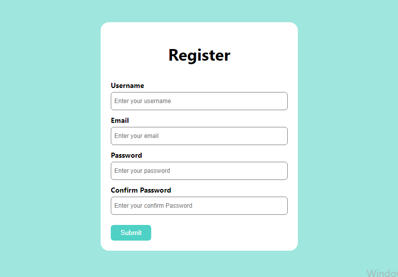
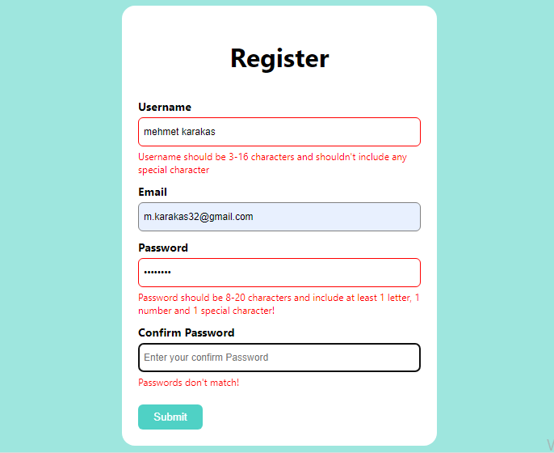

## REACT İLE FORM VALIDATION UYGULAMASI YAPILDI.

# Birinci resmimizde görüldüğü üzere projemiz form validation uygulamasıdır. React ile kodlanmıştır. Kodlamada useState hooku ve JS'de redex kullanılmıştır.

# İkinci resmimizde ise görüldüğü üzere JS regex kullanılarak girilen inputların uygunluğu denetlenmektedir.

